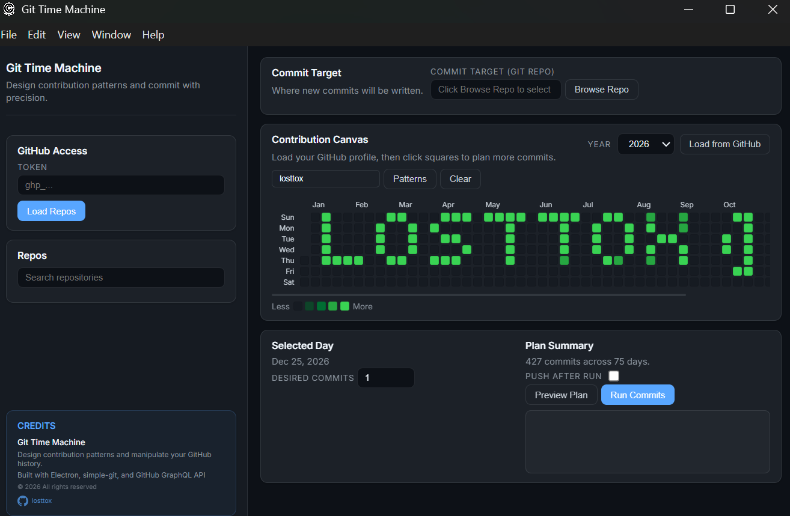

# Git Time Machine ⏰

Design your GitHub contribution history. Create patterns and backdate commits.

## Quick Start

### 1️⃣ Install & Run
- **Windows**: Double-click `start.bat`
- **Mac/Linux**: Double-click `start.sh`

### 2️⃣ Get Your GitHub Token
- Go to [github.com/settings/tokens](https://github.com/settings/tokens)
- Click "Generate new token (classic)"
- Select `repo` and `user` scopes
- Copy the token
- **CREATE A RANDOM REPO WITH ANY NAME**

### 3️⃣ Use the App
1. Paste your token
2. Click "Load Repos"
3. Select a repo and browse to the local folder (select the created one and find it in your local folder)
4. Choose a pattern (or create custom commits)
5. Click "Run Commits"
6. Check "Push after run" to upload to GitHub

## Requirements
- Node.js v14+
- Git installed
- A cloned repository on your computer
- GitHub Personal Access Token

## Patterns Available
Realistic: Casual, Busy, Organic, Mild, Intense, Sporadic
Fun: Diagonal, Wave, Smile, Blocks, Checkerboard, Gradient, Stripes
Custom: Type text to render as pixel art

## ⚠️ Important
- **Local only**: This modifies your local git history
- **Permanent**: Once pushed to GitHub if you want to delete your graph commits you have to delete the repo
- Test on a fresh repo always

---
Use responsibly! This tool is for creative and legitimate purposes only.
Made by [losttox](https://github.com/losttox).